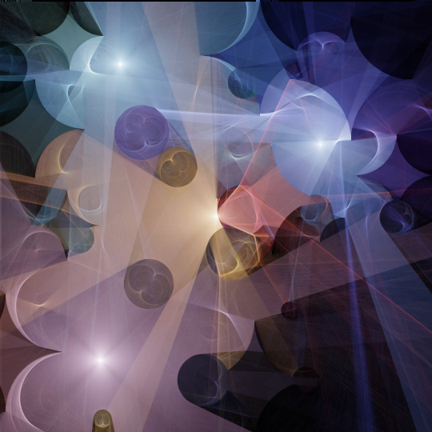
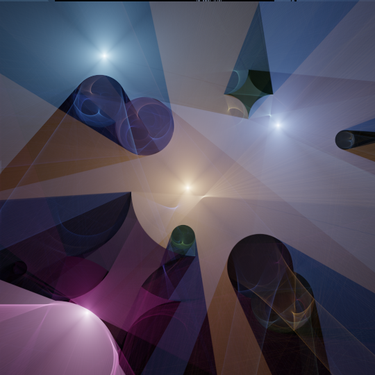
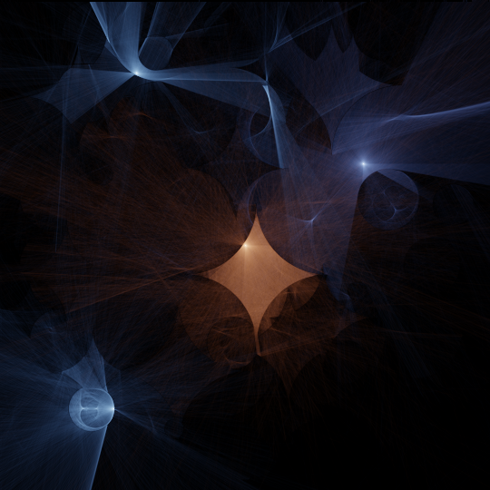
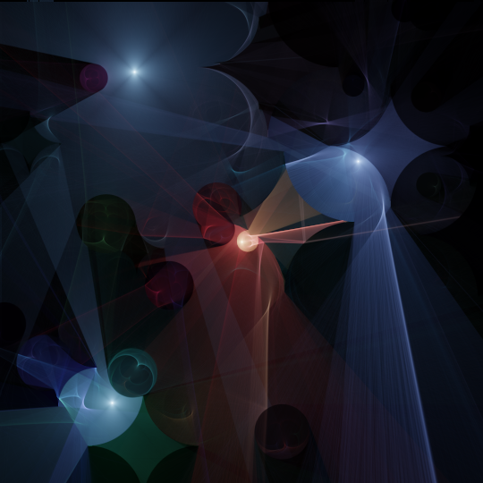

## RMPT2D

This is a (slow), (sort-of) physically-based, ray-marching, path-tracing 2d renderer written using Processing. Here's some examples of what it can do, have fun playing around with it.

